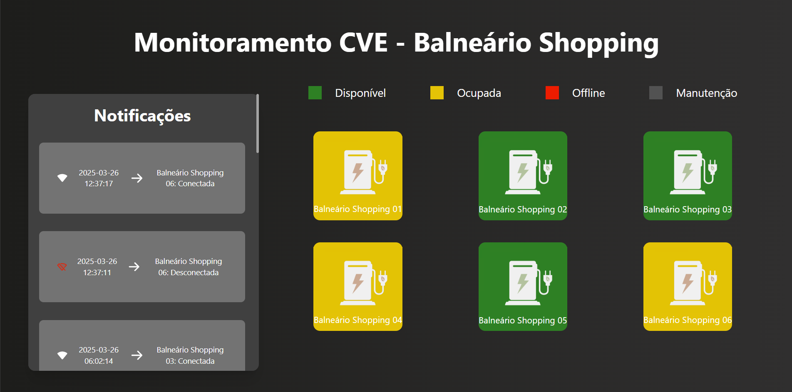

# Monitoramento CVE - Balneário Shopping

Este é a aplicação Web para monitoramento das estações de recarga para carros elétricos instaladas no Balneário Shopping.

A aplicação apresenta na sua página as estações e seu atual status e as últimas notificações de conexão de desconexão delas no servidor.



Para rodar a aplicação basta clonar o repositório.

Com SSH:
```
git@git.intelbras.com.br:ju061921/dashboard-cve.git
```

Com HTTP:
```
https://git.intelbras.com.br/ju061921/dashboard-cve.git
```

Após isso entrar na pasta do repositório e executar o comando:
```
npm install
```

## Execução

Para executar em modo de desenvolvimento: `npm run dev`

Para fazer o build da aplicação: `npm run build`

Para executar em modo de produção: `npm run start`
